>## Événements

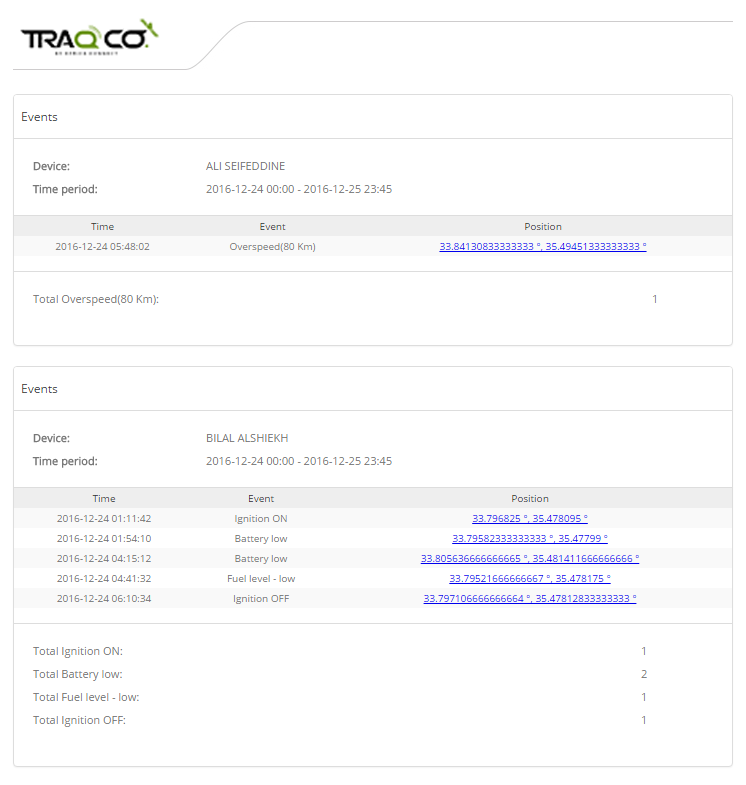

Résumé de tous les événements et alertes déclenchés.

>## Conduite et arrêt

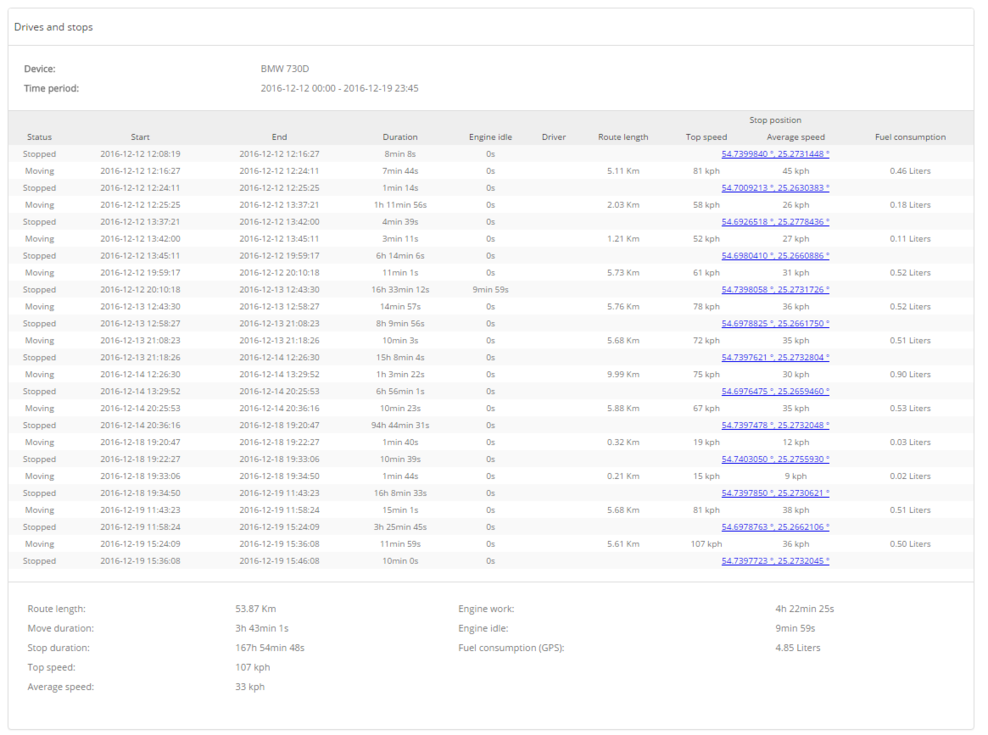

Ce rapport montre combien de fois l'appareil s'est déplacé et s'est arrêté. Durée de chaque déplacement / arrêt, longueur de l'itinéraire et informations supplémentaires.
Si le capteur de carburant est configuré, la consommation de carburant sera calculée automatiquement dans le rapport par les valeurs du capteur de carburant.
 
Lecteurs et arrêts / pilotes - lecteurs et arrêts triés par chaque pilote.
Lecteurs et arrêts / Geofences - affiche les lecteurs et les arrêts dans les geofences.

>## Heures moteur quotidiennement

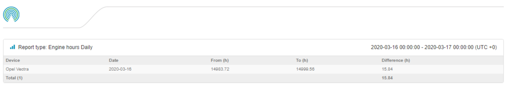

Ce rapport affiche le nombre total d'heures moteur pour toute la journée.

>## Niveau de carburant

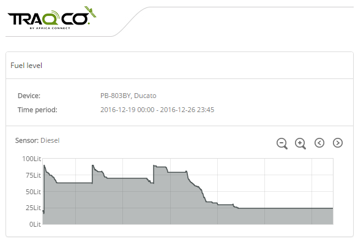

Affiche le niveau de carburant pour la période sélectionnée. Le capteur de carburant doit être configuré avant d'utiliser ce rapport.

>## Remplissages de carburant

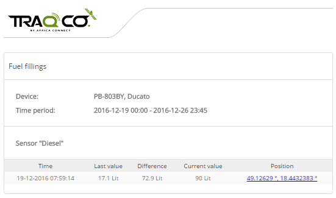

Affiche les remplissages de carburant pour la période sélectionnée. Le capteur de carburant doit être configuré avant d'utiliser ce rapport. La détection de remplissage de carburant peut être configurée dans Objets-> Édition-> Précision (idem pour le rapport de vols de carburant).

>## Informations générales

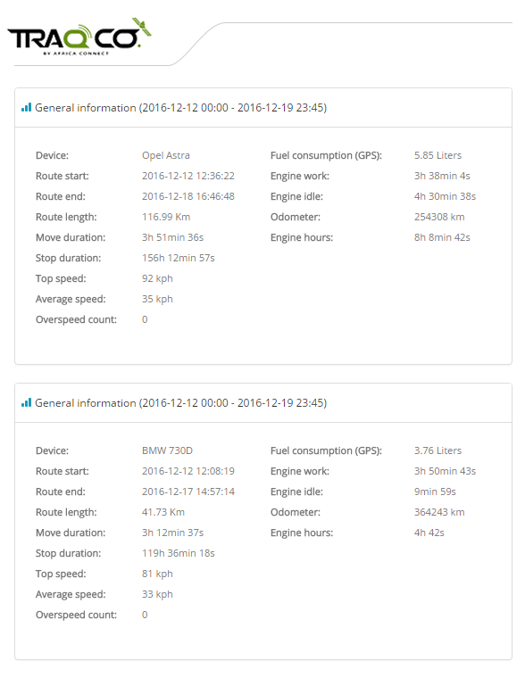

Résumé de tous les appareils GPS sélectionnés sur les itinéraires, la distance parcourue, la durée du déplacement, le nombre de survitesses, la consommation de carburant, les heures de moteur, etc.

>## Informations générales (fusionnées)

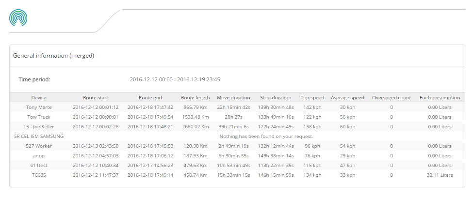

Identique au rapport d'informations générales, mais fusionné dans 1 tableau.

>## Informations générales (fusionnées) personnalisées

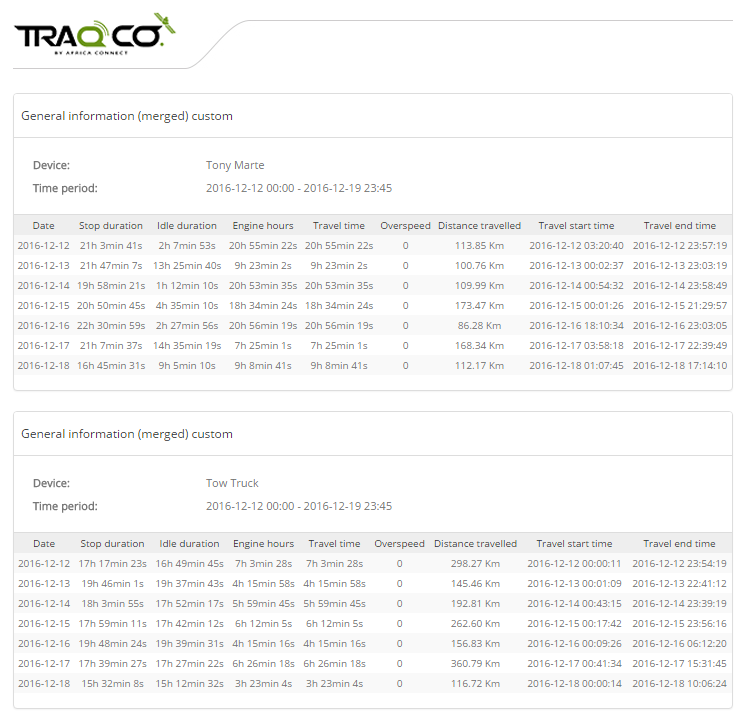

Identique au rapport d'informations générales, mais divisé en plusieurs tableaux par périphérique gps.

>## Informations générales (fusionnées) personnalisées 2

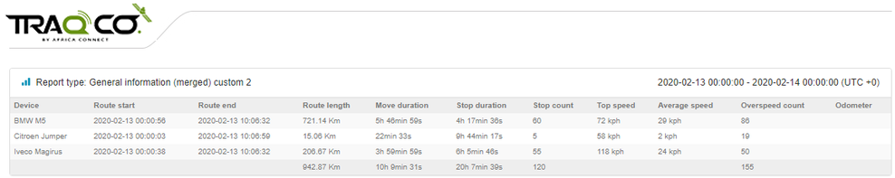

La présentation est similaire aux rapports fusionnés avec des informations supplémentaires ajoutées, telles que la durée de déplacement / arrêt, le nombre d'arrêts, le nombre de survitesse, etc.

>## Informations générales (fusionnées) personnalisées 3

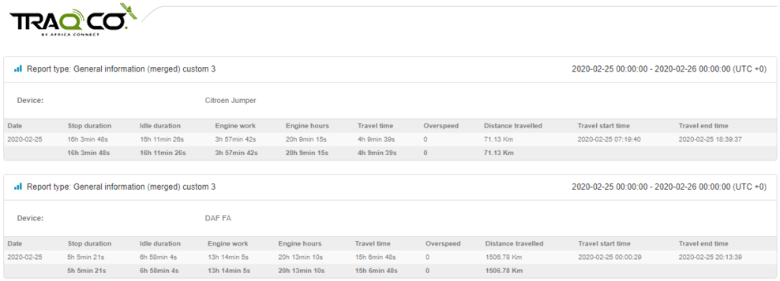

Affiche les mêmes informations que les informations générales (fusionnées) personnalisées, mais les informations de chaque appareil sont divisées en différents onglets.

>## Entrée / sortie Geofence

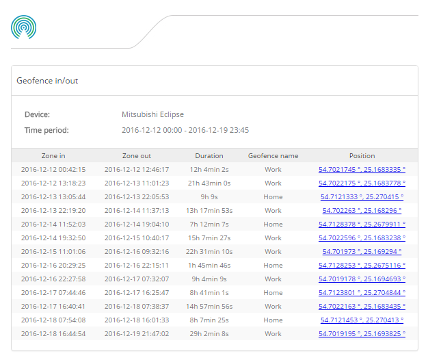

Résumé des clôtures géographiques sélectionnées pour les appareils sélectionnés.
 
Rapport de mode Geofence in / out 24 heures:
Rapport standard de clôture géographique: à
temps: 12.00 heures 21.1.2016
temps à l' extérieur : 8.00 heures 22.1.2016
- temps passé 20 heures

Mode 24 heures: le temps passé est séparé à minuit:
En temps: 12.00 heures 21.1.2016 Temps en
dehors: 0.00 heures 22.1.2016
- temps passé 12 heures

Dans le temps: 0,00 heures 21.1.2016 Temps de
sortie: 8.00 heures 22.1.2016
- temps passé 8 heures

>## Entrée / sortie Geofence (allumage ON / OFF)

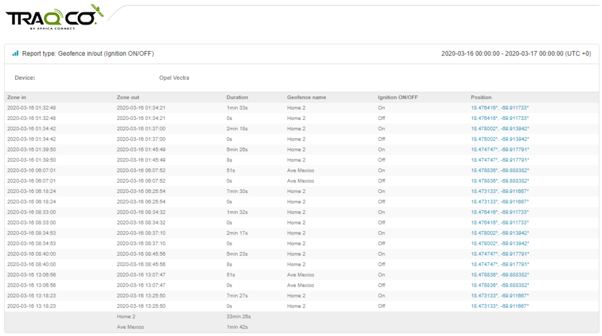

Présentation similaire au rapport d'entrée / sortie, mais avec une colonne supplémentaire, indiquant l'état d'allumage.

>## Geofence (Touchez tout)

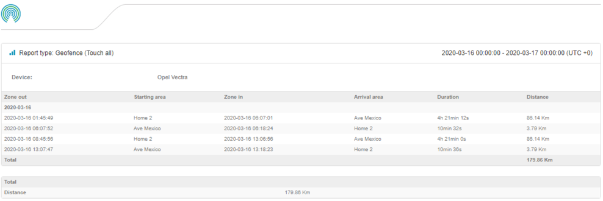

Ce type de rapport est généré uniquement si l'appareil a entré / quitté toutes les clôtures géographiques sélectionnées pendant la période spécifiée.

>## Allumage ON / OFF

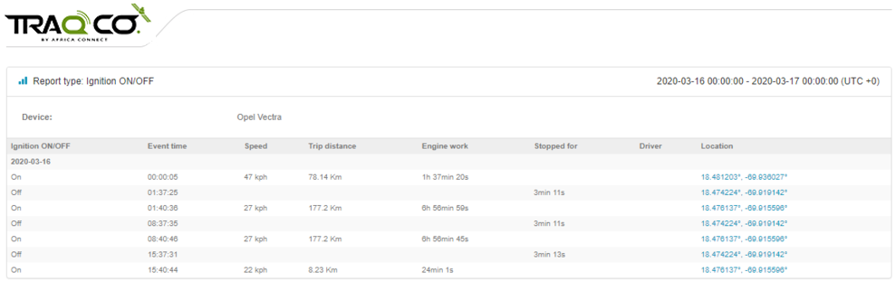

Dans ce rapport, il s'affiche lorsque l'allumage du véhicule a été activé et désactivé. Il affiche également lorsque l'événement s'est produit, la vitesse moyenne pendant le trajet, la distance parcourue, le nombre total d'heures moteur. Lorsque le contact est coupé, il affiche également la durée de la coupure et l'emplacement.

>## Survitesse

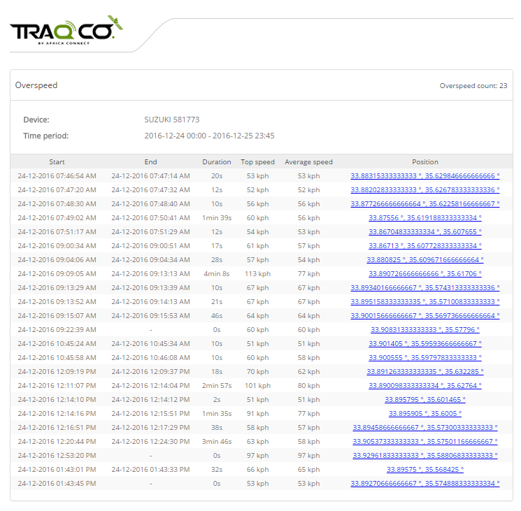

Avant de générer ce rapport, la limite de vitesse doit être définie. La vitesse ci-dessus sera considérée comme une survitesse.
Le rapport de sous-vitesse est presque le même - compte les valeurs inférieures à la limite de vitesse.

>## Survitesse / Geofences

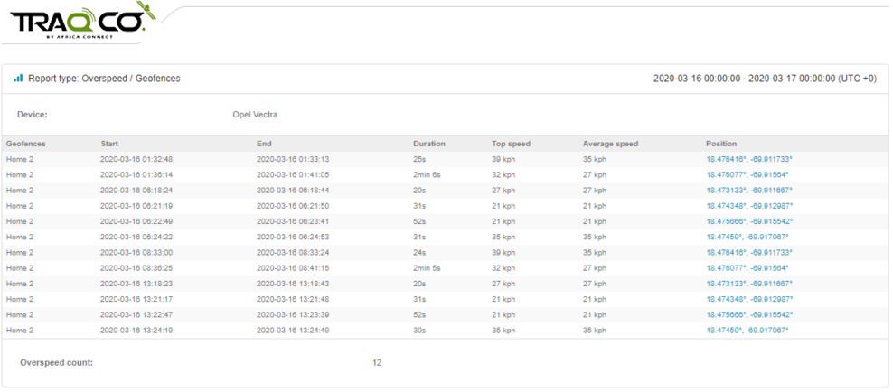

Ce rapport affiche des informations de survitesse dans les zones géographiques sélectionnées. La présentation est identique à celle du rapport de survitesse.

>## RAG (Performance du conducteur)

Les capteurs de freinage brusque et d'accélération brusque doivent être configurés en premier afin que ce rapport soit généré. Les scores finaux sont calculés dans le fichier Excel par formule. Vous pouvez ajuster cette formule à tout moment.

>## Température

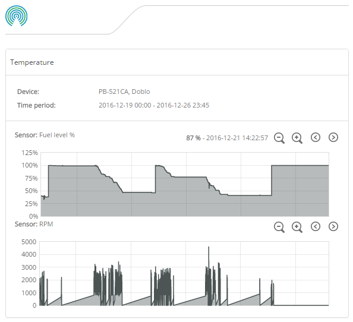

Au moins 1 capteur avec modèle de température doit être créé. Vous pouvez créer plusieurs capteurs à l'aide d'un modèle de température et tous ces capteurs seront affichés dans le rapport.

>## Feuille de voyage

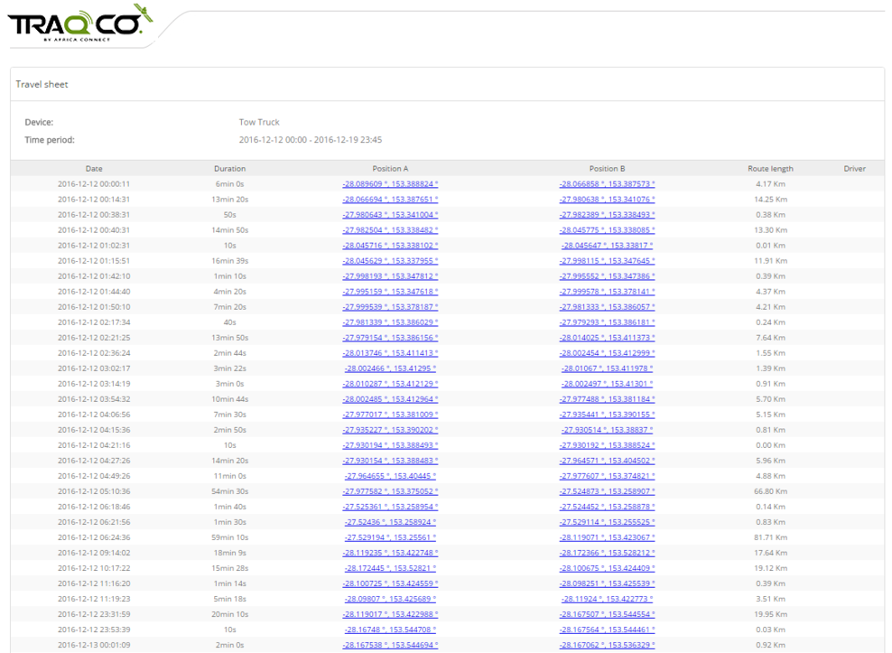

Résumé de tous les déplacements de l'appareil pendant la période sélectionnée. En cliquant sur les coordonnées, vous serez redirigé vers la carte. Il est également possible de voir l'adresse au lieu des coordonnées si vous cochez la case "affiche les adresses" lors de la génération du rapport.

>## Feuille de voyage personnalisée

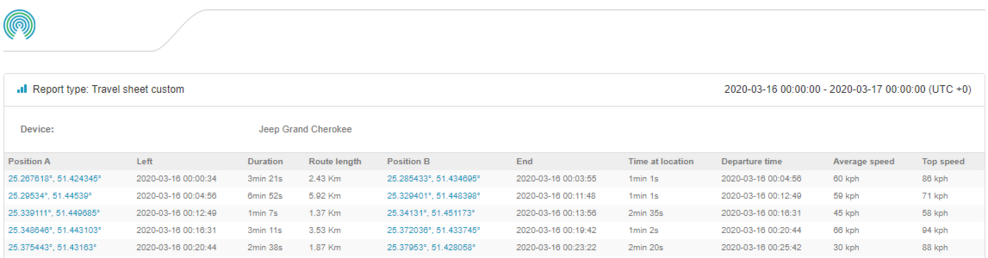

Présentation similaire au rapport de feuille de voyage, mais avec des champs d'informations supplémentaires.

>## Itinéraires

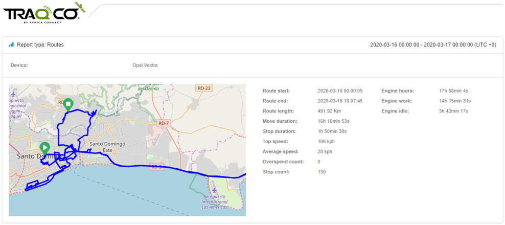

Le rapport sur les itinéraires représente l'ensemble de l'itinéraire parcouru par le véhicule avec une carte intégrée. Il fournit également des informations pertinentes telles que la distance totale parcourue, la vitesse de pointe, la vitesse moyenne, le nombre d'arrêts.

>## Commandes envoyées

Avec ce rapport, vous pouvez générer une liste de commandes de tous les utilisateurs de votre plate-forme exécutés et de son état.

>## Heures de travail quotidiennes

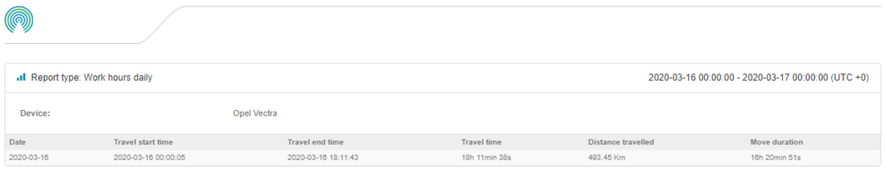

Un rapport de base qui indique le temps de voyage, le début et la fin et la distance parcourue.

