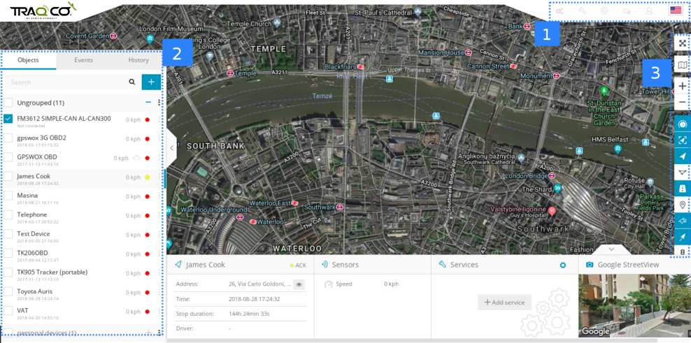
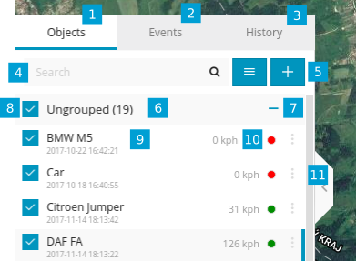

>## Ecran d'accueil

Une fois connecté, vous serez redirigé vers la page principale de la plateforme. Cette page permet d'accéder aux fonctionnalités et paramètres de suivi les plus courants, de surveiller la position de l'objet sur la carte et d'obtenir des informations détaillées telles que la vitesse, l'adresse, les coordonnées, l'historique, etc.

1.  ***Menu*** 
2.  ***Panneau de navigation*** 
3.  ***Contrôle de carte***

>## Menu

  

Le menu est utilisé pour accéder rapidement aux outils et paramètres fréquemment utilisés. Vous pouvez également changer votre langue en cliquant sur le drapeau dans le coin supérieur droit. Veuillez consulter les pages de manuel d'utilisation distinctes pour Outils , Configuration et Mon compte .

   

   

1.  ***Panneau d'administration*** 
2.  ***Outils*** 
3.  ***Installer***
4.  ***Compte***

  
   

>## Panneau de navigation

  

1. ***Onglet Objets*** - afficher et gérer tous les appareils
2. ***Onglet Événements*** - l'historique des événements et les alertes / notifications peuvent être consultés 
(survitesse, alerte de barrière géographique, batterie faible, etc.)
3. ***Onglet Historique*** - affichez l'historique détaillé de chaque appareil GPS, des graphiques, un journal de données
4. ***Recherche*** - trouver des appareils par nom ou imei
5. ***Ajouter un appareil*** - ajouter de nouveaux appareils gps
6. ***Groupes*** - nom du groupe et nombre d'appareils dans ce groupe
7. ***Expanseur de groupes*** - développer ou réduire des groupes
8. ***Case à cocher Visibilité*** - active ou désactive la visibilité des objets sur la carte
9. ***Informations sur l'objet*** - nom de l'appareil, date, heure du dernier emplacement reçu, état en ligne / inactif / hors ligne
11. ***Vitesse*** - affiche la vitesse actuelle de l'objet
12. ***Modifier l'objet*** - changez l'icône de l'appareil, attribuez-le à un groupe, ajoutez et gérez des capteurs, suivez, paramètres de précision et plus encore.

   

>## Panneau Détails de l'objet

  

Ce panneau vous permet de voir plus d'informations sur l'objet. Il apparaît lorsque vous sélectionnez votre objet. Il y a 2 options: afficher moins (standard) et afficher plus.

En afficher moins de popup, vous verrez l'adresse, la durée d'arrêt, les capteurs. En afficher plus de popup, vous verrez des informations supplémentaires comme les services, le protocole, etc.

 

   

 

>## Contrôle de la carte

  

1. ***Mode plein écran*** - masque tous les outils et affiche uniquement les appareils GPS sur la carte
2. ***Changer la carte***  - changez la carte en rues, satellite et plus
3. ***Zoom*** - zoom avant et arrière sur la carte 
4. ***Case à cocher Objets***  - affiche ou masque les objets sur la carte 
5. ***Case à cocher Geofences***  - afficher ou masquer les geofences sur la carte
6. ***Case à cocher Itinéraires***  - affiche ou masque les itinéraires sur la carte
7. ***Case à cocher POI***  - afficher ou masquer les POI sur la carte
8. ***Afficher les noms***  - afficher ou masquer les noms des objets au-dessus de l'icône sur la carte
9. ***Afficher les queues***  - afficher ou masquer les queues des objets sur la carte 

   

   

 

