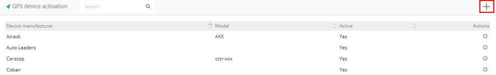
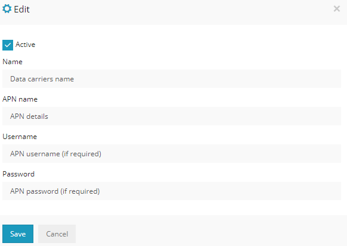

>## Création d'un appareil

Le logiciel fournit un outil qui vous permet de configurer un dispositif de suivi GPS pour envoyer des données à votre serveur sans avoir à envoyer manuellement des messages SMS.
Les appareils peuvent être configurés à partir de la plate-forme et conçus pour recevoir des messages SMS pour les configurations IP, APN et de port. Les trackers qui nécessitent la configuration d'un logiciel spécifique ne peuvent pas être configurés à l'aide de l'outil d'activation de périphérique GPS.
Il est également nécessaire de configurer une passerelle SMS afin d'envoyer des messages SMS pour la configuration. Reportez-vous à la section Passerelle SMS du manuel ici .

Pour commencer à créer et configurer un appareil, dans le panneau de gauche sous l'onglet "Appareils", sélectionnez l'icône "+".
 

Un nouveau menu apparaîtra vous demandant de renseigner le nom de l'objet et IMEI. L'IMEI de l'appareil se trouve imprimé sur un autocollant sur l'appareil. Une fois les informations remplies, sélectionnez l'option "Activation de l'appareil GPS" et sélectionnez le fabricant de l'appareil et l'APN du support de données SIM.

***REMARQUE*** : assurez-vous d'entrer le numéro de téléphone de la carte SIM avec le code du pays dans les détails de l'objet -> onglet Avancé.

S'il y a des configurations APN supplémentaires que vous souhaitez ajouter ou des fabricants supplémentaires avec des commandes SMS, les paramètres sont situés dans l'onglet "Contenu" des panneaux Administrateur.
Ceci est uniquement disponible dans le logiciel White Label.

>## Activation de l'appareil GPS

Le menu suivant affiche tous les fabricants et modèles disponibles.
Pour ajouter de nouvelles commandes pour un autre fabricant, sélectionnez l'icône "+" dans le coin droit.
Ou si une commande de fabricant déjà existante doit être ajoutée / ajustée, sous "Actions", sélectionnez l'icône d'engrenage.

Dans le menu, entrez le fabricant et le modèle de l'appareil.
Pour les commandes SMS, sélectionnez l'icône "+" et saisissez la commande requise pour configurer l'appareil. Si l'appareil nécessite la configuration de plusieurs commandes et dans un ordre spécifique, appuyez à nouveau sur le bouton "+" et une autre ligne pour les commandes sera ajoutée. Ajoutez autant de lignes de commande que nécessaire pour le périphérique. L'ordre dans lequel les commandes seront envoyées est de haut en bas.

Lors de l'ajout des commandes à la liste, au lieu d'utiliser les noms et adresses IP APN réels, incluez les variables car le système reconnaît automatiquement les configurations APN et l'adresse IP.

***Variables APN:***

* *% APNNAME%* - Il s'agit du nom APN du fournisseur de données SIM.
* *% APNUSERNAME%,% APNPASSWORD%* - Ce sont des noms d'utilisateur et des mots de passe pour l'APN. Si le support de données ne nécessite pas d'informations d'identification de connexion, celles-ci seront envoyées en blanc par le système.

***Variable d'adresse IP:***

* *% IP%* - Le système entre automatiquement l'adresse IP de votre serveur dans la configuration.

Une fois les détails saisis, sélectionnez «Enregistrer» et le fabricant récemment ajouté avec les commandes sera ajouté à la liste.

>## Configuration APN

Tous les supports de données SIM avec les détails APN sont répertoriés dans le menu de configuration APN. Pour ajouter un fournisseur supplémentaire, sélectionnez l'icône "+" sur le côté droit du menu. Ou si les configurations APN doivent être correctes, sous "Actions", sélectionnez l'icône d'engrenage.

Lors de la création d'une nouvelle configuration APN, une fenêtre apparaîtra, vous invitant à saisir le nom du support de données, le nom APN, le nom d'utilisateur et le mot de passe APN. Les informations doivent être renseignées selon les coordonnées du fournisseur.

Lorsque les informations sont remplies, sélectionnez "Enregistrer" et le support de données avec ses détails APN sera ajouté à la liste.

