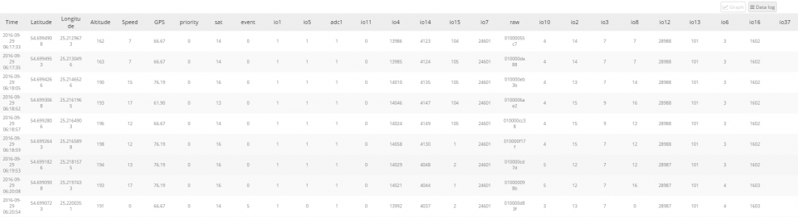
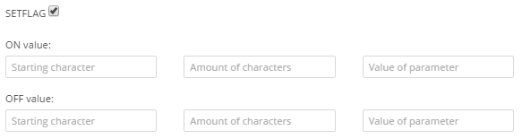
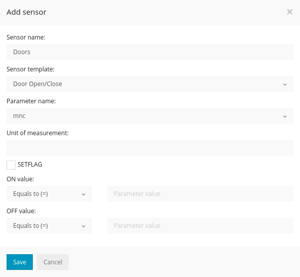
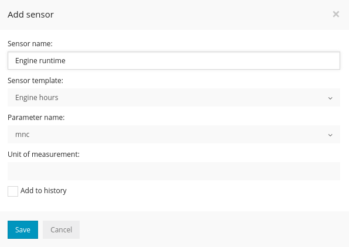
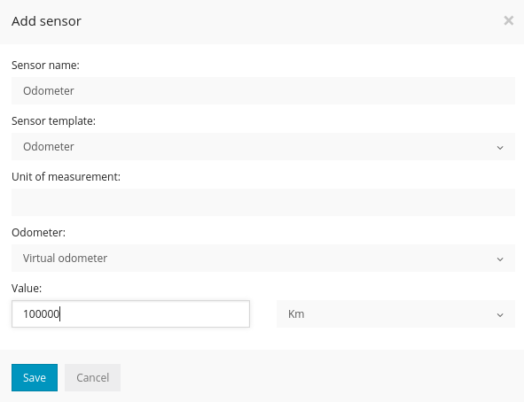

>## Ajouter un capteur

Pour ajouter un nouveau capteur (moteur en marche / arrêt, acc marche / arrêt, batterie, réservoir de carburant, odomètre, température, porte ouverte / fermée, signal GSM, signal GPS, satellites, tachymètre, etc.) pour votre objet, accédez à Objet- > Modifier l'objet-> Capteurs-> Ajouter un nouveau capteur. Mais avant de faire cela, jetez un œil ci-dessous au schéma, comment les paramètres sont envoyés à partir du périphérique GPS et comment ils doivent être couplés avec des capteurs.

Pour vérifier quels paramètres votre tracker gps envoie, veuillez aller dans Historique-> Sélectionner un objet-> Afficher l'historique-> Journal de données

(En haut se trouvent les noms des paramètres et en dessous - les valeurs des paramètres)

Il existe de nombreux noms de paramètres comme "sat, adc1, io21 ..." etc. Donc, si vous voulez créer un événement pour le paramètre "sat", vous devez saisir sat dans le champ du nom du paramètre. Ceci associera l'événement avec le paramètre.

***Remarque***: *certains trackers gps, comme Coban GPS306 OBD, envoient des noms de paramètres facilement reconnaissables (odomètre, carburant, tr / min, etc.), mais d'autres, comme Teltonika, les envoient comme ioXXX. Pour connaître la signification des noms de paramètres comme ioXXX, vous devez vérifier le manuel d'utilisation / la documentation du fabricant ou les identifier manuellement, par exemple, déclencher certains capteurs et surveiller les paramètres en même temps comme les portes ouvertes, le niveau de carburant, etc.*

>## ACC ON / OFF

* ***Nom du capteur*** - dans ce champ, vous pouvez écrire le nom de votre choix. Ce nom apparaîtra comme nom de capteur dans le panneau de détails de l'objet lorsque vous cliquez sur l'objet.
* ***Type de capteur*** - c'est le type de capteur, chaque type de capteur a des options d'entrée de paramètres et un comportement différents.
* ***Nom du paramètre*** - les noms des paramètres sont identifiés automatiquement une fois que le gps tracker est connecté à la plate-forme, sélectionnez le paramètre correspondant qui correspond à votre capteur.
* ***Unité de mesure*** - ce texte sera affiché près de la valeur, par exemple, si vous définissez le capteur de batterie, vous pouvez taper % comme unité de mesure, puis vous verrez le capteur de batterie comme "batterie: 25%"
* ***Valeur ON*** - veuillez saisir la valeur du paramètre pour identifier que l'acc a été activé. Par exemple: si le nom du paramètre est alarm: acc on, tapez acc on
* ***Valeur OFF*** - veuillez saisir la valeur du paramètre pour identifier que l'acc a été désactivé. Par exemple: si le nom du paramètre est alarm: acc off, tapez  acc off
* ***Setflag*** - est utilisé pour détecter un ou plusieurs caractères de la valeur du paramètre. Exemple: **12345** est la valeur du paramètre et **"34"** est la valeur que vous souhaitez utiliser, donc setflag serait: **3** (caractère de départ), **2** (nombre de caractères), **34** (valeur du paramètre) ".

>## Battérie

* ***Nom du capteur***  - dans ce champ, vous pouvez écrire le nom de votre choix. Ce nom apparaîtra comme nom de capteur dans le panneau de détails de l'objet lorsque vous cliquez sur l'objet.
* ***Type de capteur***  - c'est le type de capteur, chaque type de capteur a des options d'entrée de paramètres et un comportement différents.
* ***Nom du  paramètre*** - les noms des paramètres sont identifiés automatiquement une fois que le gps tracker est connecté à la plate-forme, sélectionnez le paramètre correspondant qui correspond à votre capteur. Exemple: batterie: 75 (visible dans le journal de données) doit être sélectionnée comme batterie. Dans l'exemple ci-dessus, "sat" est sélectionné, ce qui signifie que vous pouvez utiliser ***n'importe quel type*** de capteur avec ***n'importe quel type*** de paramètre.
* ***Unité de mesure***  - ce texte sera affiché près de la valeur, par exemple, si vous définissez le capteur de batterie, vous pouvez taper  %  comme unité de mesure, puis vous verrez le capteur de batterie comme "batterie: 25%"
* ***Afficher la valeur par "Valeur du paramètre"***  - la valeur du paramètre sera affichée.
* Afficher la valeur par "valeurs min / max"***  - par exemple, si la valeur de la batterie pleine est 5, minimum 0, veuillez taper 5 dans le champ de valeur max et 0 dans le champ de valeur min, afin qu'il la convertisse automatiquement en valeurs de pourcentage. Par exemple: si la valeur est 5 - 100 sera affiché, si la valeur est 4 - 75 sera affiché, si la valeur est 0 - 0 sera vu.
* ***Afficher la valeur par "Formule"***  - la valeur du paramètre peut être envoyée à partir du gps tracker encodé et vous devez utiliser la formule pour calculer la valeur de la batterie. Par exemple: si la valeur est 2850, vous pouvez taper une formule comme "([valeur] x 3,3) / 4096", par exemple: ([28501] x 3,3) / 4096 = 22,96%
* ***Valeur OFF***  - veuillez saisir la valeur du paramètre pour identifier que l'acc a été désactivé. Par exemple: si le paramètre est alarme: acc off, tapez  acc **off**

>## Ouverture / fermeture des portes

* ***Nom du capteur***  - dans ce champ, vous pouvez écrire le nom de votre choix. Ce nom apparaîtra comme nom de capteur dans le panneau de détails de l'objet lorsque vous cliquez sur l'objet.
* ***Type de capteur***  - c'est le type de capteur, chaque type de capteur a des options d'entrée de paramètres et un comportement différents.
* ***Nom du  paramètre*** - les noms des paramètres sont identifiés automatiquement une fois que le gps tracker est connecté à la plate-forme, sélectionnez le paramètre correspondant qui correspond à votre capteur.
* ***Unité de mesure***  - ce texte sera affiché près de la valeur, par exemple, si vous définissez le capteur de batterie, vous pouvez taper  %  comme unité de mesure, puis vous verrez le capteur de batterie comme "batterie: 25%"
* ***Valeur ON***  - veuillez saisir la valeur du paramètre pour identifier que l'acc a été activé. Par exemple: si le nom du paramètre est alarm: acc on, tapez  acc on
* ***Valeur OFF***  - veuillez saisir la valeur du paramètre pour identifier que l'acc a été désactivé. Par exemple si le nom du .: paramètre est alarme: état hors tension, tapez  **hors acc**

>## Marche / arrêt du moteur

* ***Nom du capteur***  - dans ce champ, vous pouvez écrire le nom de votre choix. Ce nom apparaîtra comme nom de capteur dans le panneau de détails de l'objet lorsque vous cliquez sur l'objet.
* ***Type de capteur***  - c'est le type de capteur, chaque type de capteur a des options d'entrée de paramètres et un comportement différents.
* ***Nom du  paramètre*** - les noms des paramètres sont identifiés automatiquement une fois que le gps tracker est connecté à la plate-forme, sélectionnez le paramètre correspondant qui correspond à votre capteur.
* ***Unité de mesure***  - ce texte sera affiché près de la valeur, par exemple, si vous définissez le capteur de batterie, vous pouvez taper  %  comme unité de mesure, puis vous verrez le capteur de batterie comme "batterie: 25%"
* ***Valeur ON***  - veuillez saisir la valeur du paramètre pour identifier que l'acc a été activé. Par exemple: si le nom du paramètre est alarm: acc on, tapez  acc on
* ***Valeur OFF***  - veuillez saisir la valeur du paramètre pour identifier que l'acc a été désactivé. Par exemple si le nom du .: paramètre est alarme: état hors tension, tapez  ***hors acc***

>## Heures moteur

* ***Nom du capteur***  - dans ce champ, vous pouvez écrire le nom de votre choix. Ce nom apparaîtra comme nom de capteur dans le panneau de détails de l'objet lorsque vous cliquez sur l'objet.
* ***Type de capteur***  - c'est le type de capteur, chaque type de capteur a des options d'entrée de paramètres et un comportement différents.
* ***Nom du  paramètre*** - les noms des paramètres sont identifiés automatiquement une fois que le gps tracker est connecté à la plate-forme, sélectionnez le paramètre correspondant qui correspond à votre capteur.
* ***Unité de mesure***  - ce texte sera affiché près de la valeur, par exemple, si vous définissez le capteur de batterie, vous pouvez taper  %  comme unité de mesure, puis vous verrez le capteur de batterie comme "batterie: 25%"

>## Réservoir d'essence

* ***Nom du capteur***  - dans ce champ, vous pouvez écrire le nom de votre choix. Ce nom apparaîtra comme nom de capteur dans le panneau de détails de l'objet lorsque vous cliquez sur l'objet.
* ***Type de capteur***  - c'est le type de capteur, chaque type de capteur a des options d'entrée de paramètres et un comportement différents.
* ***Nom du  paramètre*** - les noms des paramètres sont identifiés automatiquement une fois que le gps tracker est connecté à la plate-forme, sélectionnez le paramètre correspondant qui correspond à votre capteur.
* ***Unité de mesure***  - ce texte sera affiché près de la valeur, par exemple, si vous définissez le capteur de batterie, vous pouvez taper  %  comme unité de mesure, puis vous verrez le capteur de batterie comme "batterie: 25%"
* ***Nom du réservoir de carburant*** - tout nom comme essence, diesel, etc.
* ***Paramètres*** - par exemple, si l'agrafeuse envoie du carburant en valeur en pourcentage comme 100 et que le réservoir plein de votre voiture est de 40 litres, tapez 40 sur le côté gauche (réservoir plein) et 100 sur le côté droit (valeur du paramètre), donc lorsque le tracker envoie valeur du paramètre 50, vous verrez que le réservoir de carburant de votre voiture est de 20 litres ou gallons.

>## Réservoir de carburant avec étalonnage

* ***Nom du capteur***  - dans ce champ, vous pouvez écrire le nom de votre choix. Ce nom apparaîtra comme nom de capteur dans le panneau de détails de l'objet lorsque vous cliquez sur l'objet.
* ***Type de capteur***  - c'est le type de capteur, chaque type de capteur a des options d'entrée de paramètres et un comportement différents.
* ***Nom du  paramètre*** - les noms des paramètres sont identifiés automatiquement une fois que le gps tracker est connecté à la plate-forme, sélectionnez le paramètre correspondant qui correspond à votre capteur.
* ***Unité de mesure***  - ce texte sera affiché près de la valeur, par exemple, si vous définissez le capteur de batterie, vous pouvez taper  %  comme unité de mesure, puis vous verrez le capteur de batterie comme "batterie: 25%"
* ***Nom du réservoir de carburant***  - tout nom comme essence, diesel, etc.
* ***Étalonnage***  - les trackers gps peuvent envoyer le niveau de carburant en tensions ou en toute autre valeur, un étalonnage est donc nécessaire. Ci-dessus est un exemple de valeur de paramètre et de valeur de litres / gallons correspondante. Il est préférable de commencer l'étalonnage avec le réservoir plein et de vérifier la valeur du paramètre, puis de continuer avec le réservoir de carburant vide et de vérifier à nouveau la valeur du paramètre.

>## GSM

* ***Nom du capteur***  - dans ce champ, vous pouvez écrire le nom de votre choix. Ce nom apparaîtra comme nom de capteur dans le panneau de détails de l'objet lorsque vous cliquez sur l'objet.
* ***Type de capteur*** - c'est le type de capteur, chaque type de capteur a des options d'entrée de paramètres et un comportement différents.
* ***Nom du  paramètre*** - les noms des paramètres sont identifiés automatiquement une fois que le gps tracker est connecté à la plate-forme, sélectionnez le paramètre correspondant qui correspond à votre capteur.
* ***Unité de mesure***  - ce texte sera affiché près de la valeur, par exemple, si vous définissez le capteur de batterie, vous pouvez taper  %  comme unité de mesure, puis vous verrez le capteur de batterie comme "batterie: 25%"
* ***Afficher la valeur par "valeurs min / max"***  - par exemple, si la valeur de la batterie pleine est 5, minimum 0, veuillez taper 5 dans le champ de valeur max et 0 dans le champ de valeur min, afin qu'il la convertisse automatiquement en valeurs de pourcentage. Par exemple: si la valeur est 5 - 100 sera affiché, si la valeur est 4 - 75 sera affiché, si la valeur est 0 - 0 sera vu.

>## Accélération brutale et freinage brutal

* ***Nom du capteur***  - dans ce champ, vous pouvez écrire le nom de votre choix. Ce nom apparaîtra comme nom de capteur dans le panneau de détails de l'objet lorsque vous cliquez sur l'objet.
* ***Type de capteur***  - c'est le type de capteur, chaque type de capteur a des options d'entrée de paramètres et un comportement différents.
* ***Nom du  paramètre*** - les noms des paramètres sont identifiés automatiquement une fois que le gps tracker est connecté à la plate-forme, sélectionnez le paramètre correspondant qui correspond à votre capteur.
* ***Valeur de paramètre***  - valeur pour détecter une accélération ou un freinage brutal. Une fois les valeurs configurées, vous pouvez ensuite générer un rapport de comportement du pilote: Outils-> Rapports-> RAG

>## Allumage ON / OFF

* ***Nom du capteur***  - dans ce champ, vous pouvez écrire le nom de votre choix. Ce nom apparaîtra comme nom de capteur dans le panneau de détails de l'objet lorsque vous cliquez sur l'objet.
* ***Type de capteur***  - c'est le type de capteur, chaque type de capteur a des options d'entrée de paramètres et un comportement différents.
* ***Nom du  paramètre*** - les noms des paramètres sont identifiés automatiquement une fois que le gps tracker est connecté à la plate-forme, sélectionnez le paramètre correspondant qui correspond à votre capteur.
* ***Unité de mesure***  - ce texte sera affiché près de la valeur, par exemple, si vous définissez le capteur de batterie, vous pouvez taper  %  comme unité de mesure, puis vous verrez le capteur de batterie comme "batterie: 25%"
* ***Valeur ON***  - veuillez saisir la valeur du paramètre pour identifier que l'acc a été activé. Par exemple: si le nom du paramètre est alarm: acc on, tapez  acc on
* ***Valeur OFF***  - veuillez saisir la valeur du paramètre pour identifier que l'acc a été désactivé. Par exemple si le nom du .: paramètre est alarme: état hors tension, tapez  ***hors acc***

>## Odomètre (connecté et virtuel)

* ***Nom du capteur***  - dans ce champ, vous pouvez écrire le nom de votre choix. Ce nom apparaîtra comme nom de capteur dans le panneau de détails de l'objet lorsque vous cliquez sur l'objet.
* ***Type de capteur***  - c'est le type de capteur, chaque type de capteur a des options d'entrée de paramètres et un comportement différents.
* ***Nom du  paramètre*** - les noms des paramètres sont identifiés automatiquement une fois que le gps tracker est connecté à la plate-forme, sélectionnez le paramètre correspondant qui correspond à votre capteur.
* ***Unité de mesure***  - ce texte sera affiché près de la valeur, par exemple, vous pouvez définir km ou mi
* ***Odomètre*** - si vous avez sélectionné l'odomètre connecté, veuillez le coupler avec le paramètre responsable de la valeur de l'odomètre connecté, sinon veuillez sélectionner Odomètre virtuel.
* ***Forumula***  - la valeur peut être envoyée en mètres, kilomètres, miles, pieds, etc., donc en utilisant la formule, vous pouvez appliquer des calculs corrects.

>## Satellites

* ***Nom du capteur***  - dans ce champ, vous pouvez écrire le nom de votre choix. Ce nom apparaîtra comme nom de capteur dans le panneau de détails de l'objet lorsque vous cliquez sur l'objet.
* ***Type de capteur***  - c'est le type de capteur, chaque type de capteur a des options d'entrée de paramètres et un comportement différents.
* ***Nom du  paramètre*** - les noms des paramètres sont identifiés automatiquement une fois que le gps tracker est connecté à la plate-forme, sélectionnez le paramètre correspondant qui correspond à votre capteur.
* ***Unité de mesure***  - ce texte sera affiché près de la valeur, par exemple, si vous définissez le capteur de batterie, vous pouvez taper  %  comme unité de mesure, puis vous verrez le capteur de batterie comme "batterie: 25%"

>## Tachymètre / RPM ou température

* ***Nom du capteur***  - dans ce champ, vous pouvez écrire le nom de votre choix. Ce nom apparaîtra comme nom de capteur dans le panneau de détails de l'objet lorsque vous cliquez sur l'objet.
* ***Type de capteur***  - c'est le type de capteur, chaque type de capteur a des options d'entrée de paramètres et un comportement différents.
* ***Nom du  paramètre*** - les noms des paramètres sont identifiés automatiquement une fois que le gps tracker est connecté à la plate-forme, sélectionnez le paramètre correspondant qui correspond à votre capteur.
* ***Unité de mesure***  - ce texte sera affiché près de la valeur, par exemple, si vous définissez le capteur de batterie, vous pouvez taper  %  comme unité de mesure, puis vous verrez le capteur de batterie comme "batterie: 25%"
* ***Formula***  - en utilisant la formule, vous pouvez appliquer des calculs corrects.
