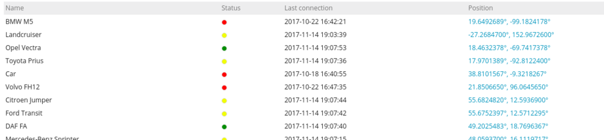
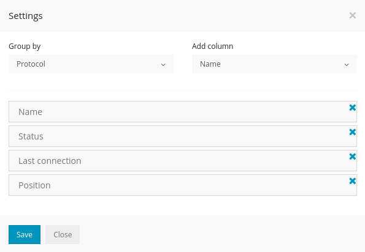
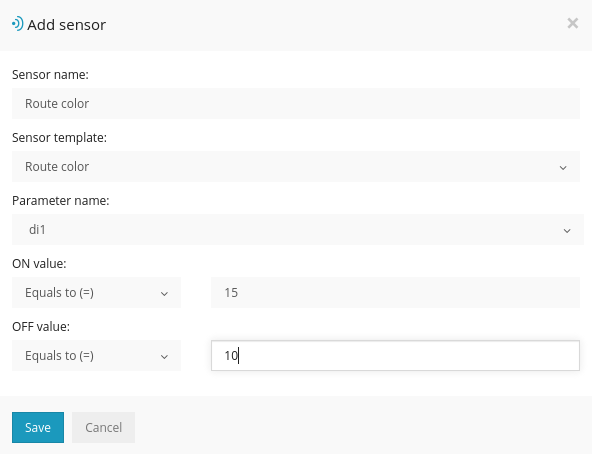
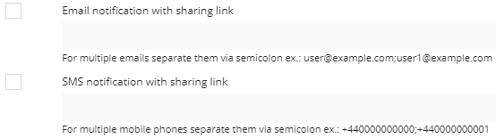
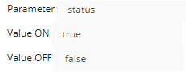

>## Activation/Désactivation

Les plugins peuvent être activés ou désactivés dans le panneau de configuration administrateur et ils se trouvent dans Admin -> Configuration-> Plugins. Voici une liste de plugins et des descriptions de ce qu'ils font. Cette page est constamment mise à jour à mesure que de nouveaux plugins sont développés.

>## Liste d'objets

>## Disques professionnels / privés

S'il est activé, il sera possible d'ajouter des capteurs supplémentaires pour les disques professionnels et privés. Si ces capteurs sont ajoutés, vous pourrez voir ces disques dans l'historique dans différentes couleurs et également générer des rapports sur les disques et les arrêts qui afficheront uniquement des informations sur les disques professionnels et privés.

>## Couleur de l'itinéraire

Lorsqu'il est activé, un modèle de capteur supplémentaire sera disponible. Il est utilisé pour afficher une couleur différente dans l'historique de l'appareil lorsque des critères de paramètres spécifiques sont remplis.
Par exemple, si le paramètre ON envoie une valeur définie, la couleur de l'itinéraire changera pour celle sélectionnée.

>## Animation de déplacement de périphérique

Ce plugin permet une animation de mouvement de la flèche de l'objet sur la carte, simulant un mouvement en temps réel.

>## Widget de l'appareil sur la distance totale

Affiche la distance totale parcourue par l'appareil. La distance est calculée par le logiciel entre les points de données GPS envoyés par l'appareil. La distance est située dans le widget capteurs des appareils.

>## Le widget de l'appareil affiche l'adresse complète

Dans le widget "Objet", il affichera l'adresse complète au lieu d'une adresse abrégée.

>## Notification de partage d'alertes

Lorsque le plugin est activé, vous pourrez envoyer une notification d'alerte avec un lien par e-mail et SMS pour afficher l'emplacement et le mouvement des objets sur la carte.
Il est possible de définir un délai d'expiration en minutes avant que le lien ne devienne inactif. L'option "supprimer après expiration" supprime définitivement le lien dans l'onglet "Partages" de l'outil "Partage".

Dans l'onglet "notifications", il y aura 2 lignes supplémentaires pour les e-mails et les numéros de téléphone qui devraient recevoir le lien de partage lorsque l'alerte est déclenchée

>## Verrouillage

Ce plugin ajoute un widget supplémentaire dans la barre d'outils des cartes qui affiche l'état d'un verrou intégré à un appareil GPS.
Dans les paramètres du plugin, spécifiez le paramètre qui envoie l'état de verrouillage ainsi que les paramètres.

Un aperçu du widget de verrouillage:

