>## Outils: vue d'ensemble

Les outils sont utilisés pour créer des alertes / notifications, des clôtures géographiques, des POI, envoyer des commandes aux trackers GPS, générer des rapports et bien plus encore.

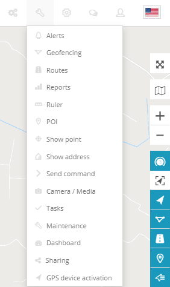

>## Outils: alertes

Pour créer une alerte, choisissez «Alertes» dans le menu «Outils» de la fenêtre principale de la carte et appuyez sur le bouton «*Ajouter une alerte*» (icône bleue «*+*») sur le panneau des alertes.

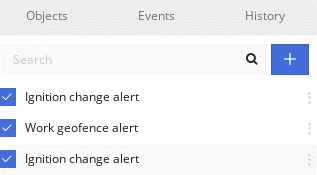

Une nouvelle fenêtre de panneau s'ouvrira. Commencez à créer une alerte en remplissant les informations requises. 

>#### Dispositifs

Saisissez le nom de l'alerte (obligatoire) et sélectionnez les objets (requis) pour lesquels l'alerte sera générée.

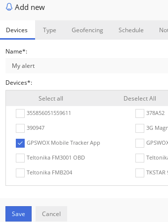

>#### Type

Sélectionnez le type d'alerte dans la liste. Il existe 7 types décrits comme suit.

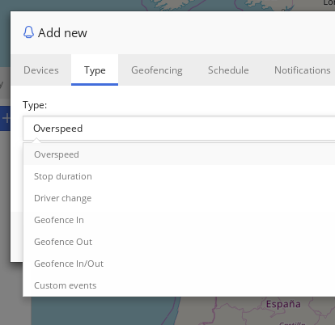

***Survitesse*** - cette alerte est générée lorsque les objets dépassent la valeur entrée.

***Durée d'arrêt*** - cette alerte sera générée lorsque l'objet ne se déplace pas pendant une durée définie en minutes.

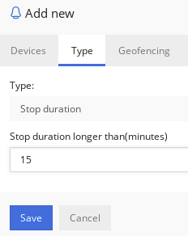

***Changement de pilote*** - cette alerte sera générée lorsque le pilote sur l'objet change des pilotes sélectionnés dans la liste.

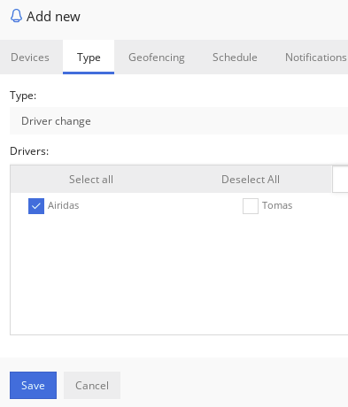

***Geofence In*** - cette alerte sera générée lorsque l'objet se rendra dans le geofence.

***Geofence Out*** - cette alerte se déclenchera lorsque l'objet sortira du geofence.

***Geofence In / Out*** - cette alerte sera générée lorsque l'objet se déplacera dans ou hors de la barrière géographique. Notez que lorsque vous sélectionnez les types d'alerte "**Geofence In**", "**Geofence out**" ou "**Geofence In / Out**", l'onglet "*Geofencing*" sera désactivé.

***Événements personnalisés*** - cette alerte est générée lorsque des événements personnalisés ou à l'échelle du système créés par l'utilisateur sont générés.

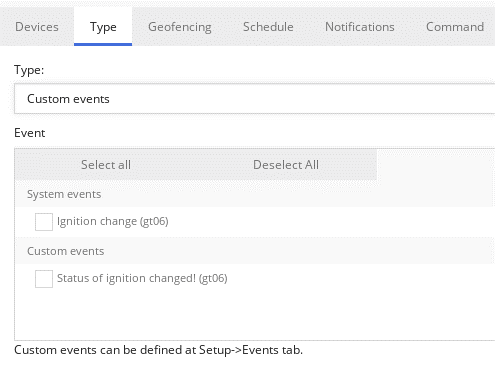

>#### Geofencing

Sélectionnez les clôtures géographiques qui généreront une alerte lorsque l'objet se déplacera à l'intérieur ou à l'extérieur de la clôture géographique. Cela fonctionnera avec d'autres types d'alertes. Par exemple, il ne générera une alerte de survitesse que lors d'un déplacement à l'intérieur ou à l'extérieur de la clôture géographique.

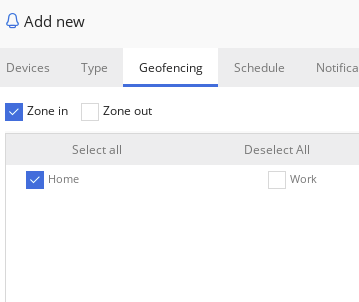

>#### Programme

Sélectionnez quand l'alerte sera active. Appuyez sur la souris et peignez sur la table du calendrier. Un élément du tableau dure 15 minutes. L'horodatage exact peut être vu en survolant l'élément avec une souris.

>#### Notifications

Sélectionnez les notifications qu'un utilisateur recevra lorsque l'alerte sera générée.

Il existe une notification sonore qui émet un son sur le navigateur Web une fois l'alerte générée.

Les notifications push fonctionnent également sur les applications mobiles.

La notification par e-mail enverra un e-mail. 

Des notifications par SMS seront envoyées aux numéros fournis. La passerelle SMS doit être activée pour afficher cette partie des notifications.

La notification Webhook utilisera le protocole HTTP pour publier les données à l'adresse donnée.

>#### Commander

Sélectionnez la commande à activer lorsque l'alerte est générée. La commande sera envoyée au périphérique via le réseau GPRS. 

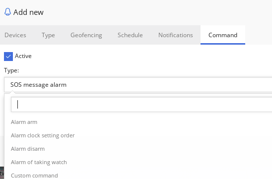

Appuyez sur le bouton "*Enregistrer*" pour terminer les étapes de création d'alerte et fermer la fenêtre de création d'alerte. 

>## Outils: Geofencing

>#### Créer une clôture géographique

Pour créer une nouvelle clôture géographique, cliquez sur  *Outils-> Geofencing-> Ajouter une clôture géographique* . Tapez le nom de la clôture géographique et sélectionnez sa couleur, puis cliquez sur la carte pour commencer à dessiner la clôture géographique. Une fois le dessin de la clôture géographique terminé, cliquez sur le dernier point et cliquez sur *Enregistrer* .

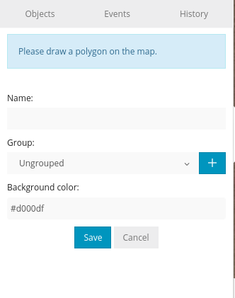

Une fois la clôture géographique créée, vous pouvez les afficher tous dans la liste et les modifier à tout moment.

>#### Importer et exporter

Pour importer ou exporter une clôture géographique, cliquez sur le bouton avec une icône d'engrenage:

Pour l'exportation simple, par groupes, les geofences actives et inactives peuvent être sélectionnées:

L'exportation est enregistrée dans un fichier .gexp.
 
Pour l'importation, seul le fichier **.gexp** peut être utilisé. 

>#### Structure du fichier .gexp

Il s'agit d'un simple fichier texte qui a la structure suivante.

Exemple (unique):

    {"groups": [], "geofences": [{"id": 1130, "group_id": 0, "name": "vn", "coordonnées": "[{\" lat \ ": 48.108348176168, \ "lng \": 14.284973144531}, {\ "lat \": 48.111099041065, \ "lng \": 14.403076171875}, {\ "lat \": 48.035855735787, \ "lng \": 14.400329589844}] "," polygon_color ": "# a34949"}]}

Format:

**" groups "** - le nom du groupe geofence appartient. **Emtpy []** signifie non groupé.

**" geofences "** - liste des geofences. A l'intérieur, il faut remplir "**id**", "**group_id**", "**name**" et **"coordonnées"** - "**Coordonnées**" nécessite une liste de "**lat**" et "**lng**" de coordonnées à remplir.

**" polygon_color "** - couleur en code hexadécimal html.

>## Outils: Rapports

>#### Principale

Pour créer un nouveau rapport ou le planifier, cliquez sur *Outils-> Rapports *

**rapport**

* ***Titre***  - titre / nom du rapport
* ***Type*** - sélectionnez le type de rapport
    * ***Informations générales*** - le rapport présente des informations de base: vitesse maximale, vitesse moyenne, carburant consommé,  longueur de l'itinéraire,  etc.
    * ***Informations générales (fusionnées)*** - informations générales affichées dans une rangée.
    * ***Conduites et arrêts*** - mêmes informations que le rapport général, mais ajoutées: les objets s'arrêtent et les informations de conduite, comme la durée des intervalles entre les arrêts, l'  adresse où l'objet s'est arrêté.
    * ***Feuille de voyage*** - affiche les coordonnées et les adresses des arrêts, la consommation de carburant, la longueur entre les arrêts .
    * ***Survitesse*** - les cas d'excès de vitesse seront affichés dans le rapport ainsi que des informations supplémentaires telles que le temps excessif,  la vitesse dépassée.
    * ***Sous -vitesses*** - les cas de sous-vitesse seront affichés dans le rapport.
    * ***Geofence in / out*** - heure d'entrée / sortie dans chaque zone et zone de sortie, temps de séjour dans la zone.
    * ***Événements*** - informations sur les événements: coordonnées et adresse du nom de l'événement, heure.
    * ***Service*** - informations sur le service.
    * ***Niveau de carburant*** - informations sur les changements de niveau de carburant.
    * ***Remplissages de carburant*** - historique des remplissages de carburant d'objet.
    * ***Vols de carburant*** - histoire des vols de carburant.
* ***Format*** - sélectionnez le format dans lequel le rapport sera généré:  PDF (pour la visualisation dans Adobe Acrobat Reader),  HTML (pour la visualisation dans le navigateur), XLS (pour la visualisation et la modification dans Microsoft Excel)
* ***Afficher les adresses*** - à proximité des points de localisation, les  adresses seront affichées.
Zones au lieu des adresses - au lieu des adresses  , les noms de zone seront affichés.
* ***Arrêts*** - définissez l'heure des arrêts pour éliminer les arrêts aux feux de circulation.
* ***Limite de vitesse (km / h)*** - limite de vitesse pour les rapports de survitesse et de sous-vitesse.

**Programme**

* ***Quotidien*** - des rapports seront envoyés chaque jour pour la veille.
* ***Hebdomadaire*** - les rapports seront envoyés une fois par semaine, tous les lundis de la semaine précédente.
* ***Envoyer par e-mail*** - entrez les adresses e-mail séparées par une virgule pour envoyer les rapports.

**Dispositifs**

Sélectionnez les appareils pour créer un rapport.

**Geofences**

Cela permet de sélectionner des zones dont les détails seront visibles dans le rapport. La sélection de zone n'est disponible que si le type de rapport *Zone in / out* est choisi.

**Période de temps**

* ***Filtre*** - moyen facile de régler la période de temps.
* ***Time from / Time to*** - définir la période de temps du rapport.

>#### Rapports générés

Tous les rapports générés peuvent être visibles dans cet onglet. Vous pouvez les modifier, les régénérer et les supprimer.

>#### Journaux de rapports planifiés

Tous les rapports générés planifiés. Si vous ne les avez pas reçus par e-mail ou si vous n'en avez pas besoin, vous pouvez tous les consulter ici.

>## Outils: envoyer une commande

Les commandes peuvent être envoyées via GPRS ou SMS (la passerelle sms doit être activée ( *Configuration-> SMS* )).

Type - si vous sélectionnez une commande personnalisée, vous pourrez envoyer la commande RAW gprs au périphérique ou sélectionner le **modèle GPRS** que vous avez créé dans *Configuration-> Modèles GPRS*.

Si vous voulez voir vos commandes gprs spécifiées pour le périphérique sélectionné uniquement, veuillez aller dans *Objets-> Modifier-> Avancé-> Afficher les modèles gprs uniquement*.

Pour envoyer la commande sms à l'appareil, la passerelle sms doit être activée ( *Setup-> SMS* ).

>## Outils: Autre

>#### Règle

Pour vérifier la distance entre 2 points ou plus, cliquez sur  *Outils-> Règle* et commencez à cliquer sur la carte.

>#### POI

POI - point d'intérêt. Ce sont les icônes que vous pouvez placer n'importe où sur la carte et créer une étiquette pour celle-ci. Le format de fichier d'importation de POI est **.KML**.

>#### Afficher le point

Avec cet outil, vous pouvez voir le point sur la carte en entrant des coordonnées ou une adresse.

>#### Afficher l'adresse

Affiche une adresse par coordonnées.

>## Outils: appareil photo

>#### Appareil photo / outil multimédia

Avec cet outil, vous pouvez capturer des images de chaque traceur GPS, auquel est attaché un appareil photo. Dans la fenêtre, vous pouvez voir tous les trackers auxquels les caméras sont connectées, vous pouvez également afficher les photos prises, sélectionner la caméra via son identifiant, s'il y a plus d'une caméra connectée, afficher l'adresse et la carte où la photo était pris.

Il peut être trouvé via le menu principal *Outils> Appareil photo / Média*.

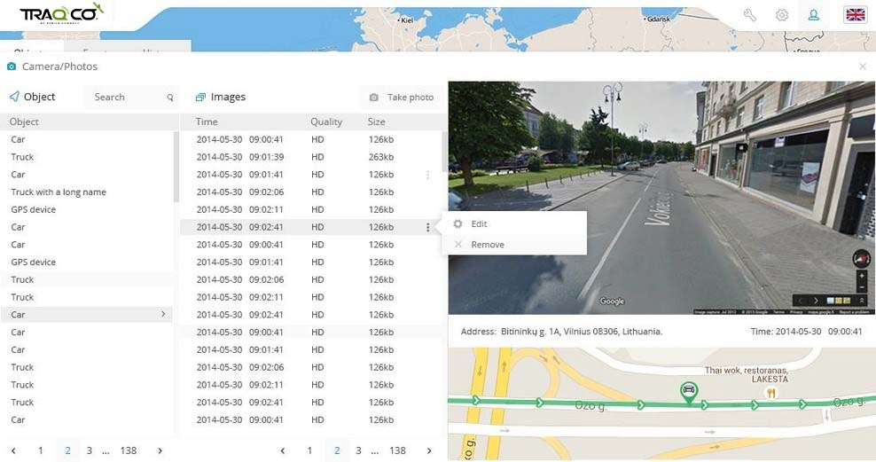

>#### Outil caméra / DVR

Si gps tracker ne prend pas en charge l'appareil photo ou si vous souhaitez connecter un autre appareil photo dans la voiture, quel que soit le gps tracker que vous utilisez, cet outil peut être utile. Une fois que la ou les caméras IP sont connectées dans la voiture, les coordonnées GPS seront associées à la caméra par la date et l'heure disponibles les plus proches.

Pour commencer, veuillez aller dans *Modifier l'appareil-> Caméras-> Ajouter une caméra*:

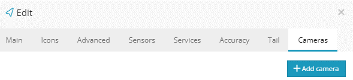

Tapez n'importe quel nom que vous aimez et cochez "Afficher le widget" si vous voulez voir l'image en temps réel dans le menu des widgets.
Une fois cela fait, le nom d'utilisateur et le mot de passe ftp seront générés automatiquement pour votre caméra. Veuillez utiliser ces informations d'identification pour configurer les paramètres FTP de votre caméra IP afin qu'elle puisse commencer à envoyer des images au serveur gps:

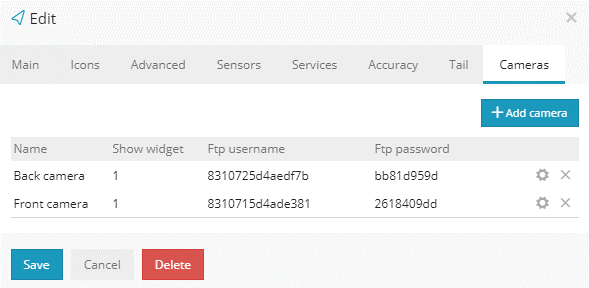

Une fois les paramètres FTP des caméras définis, vous commencerez à en voir des images en temps réel. Vous pouvez également prévisualiser l'historique et les photos ainsi que l'emplacement de l'appareil:

Dans le panneau d'administration, vous pouvez définir combien de jours pour conserver les images de la caméra de l'appareil, dans *Admin-> Configuration-> Paramètres du serveur principal*.

>## Outils: tâches

Cet outil vous permet de créer des tâches, telles que des livraisons qui peuvent être affectées à des objets en utilisant uniquement l'application de suivi GPS mobile.

Pour créer une tâche, accédez à *Outils -> Tâches*

Une nouvelle fenêtre apparaîtra qui vous demandera de remplir les détails nécessaires pour la tâche, tels que les adresses de ramassage et de livraison, le nom de la tâche, la priorité, la description et l'objet de la tâche à affecter.

.

Une fois toutes les informations saisies, sélectionnez «*Enregistrer*» et ouvrez l'application de suivi GPS mobile.
Depuis l'application, accédez à l'outil Tâches et vous serez accueilli avec les tâches affectées à l'objet. Pour accepter la tâche, appuyez sur "*Accepter*".

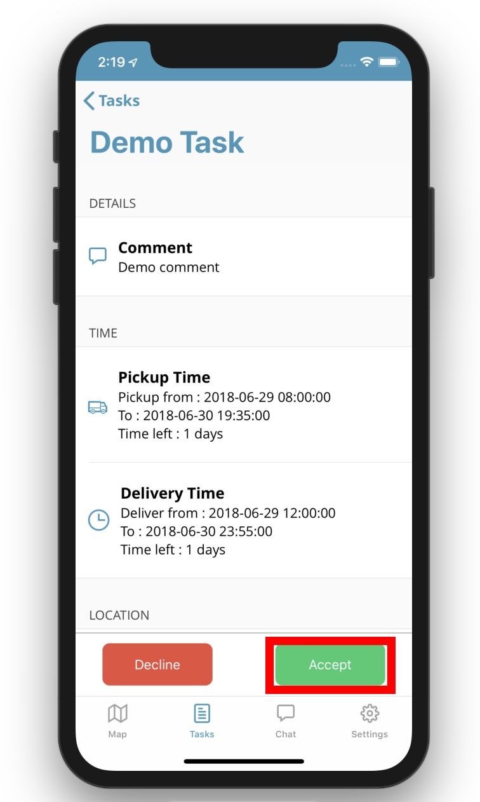

Une fois la tâche terminée, vous pourrez laisser une signature, confirmant que la tâche est terminée.

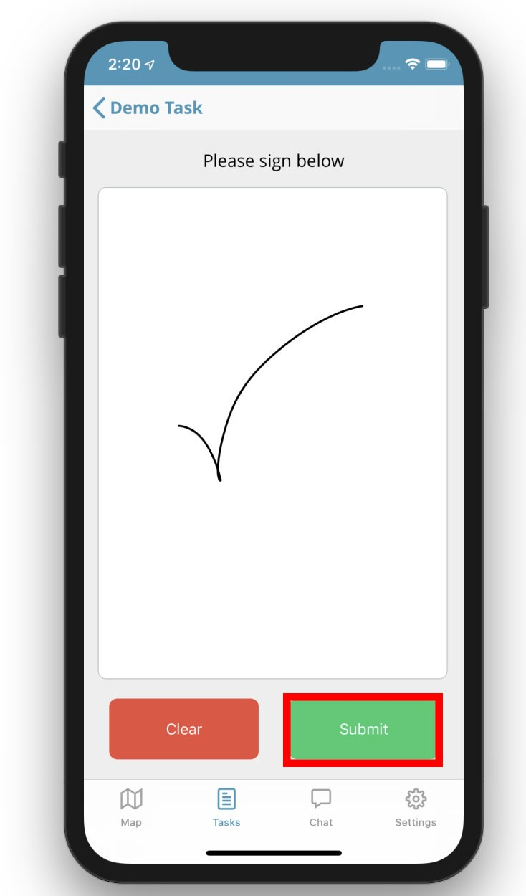

Pour afficher l'état de toutes les tâches créées, sélectionnez l'option "Toutes les tâches" dans la fonction Tâche des plates-formes Web.
Vous pourrez également consulter la signature des livraisons complétées.

>## Outils: Maintenance

Avec l'outil d'entretien, vous pouvez configurer le programme d'entretien du véhicule pour vous rappeler quand le prochain entretien du véhicule est dû.
Pour ouvrir l'outil de maintenance, sélectionnez l'onglet "Services" dans les détails des objets, ou en activant le widget "*Service*" dans *Configuration -> Widgets*, qui apparaît en bas de la carte lors de la sélection et de la sélection de l'icône d'engrenage.

Accès à l'outil de maintenance via les détails de l'objet:

Via le widget "*Service*" en sélectionnant l'icône d'engrenage:

Après avoir ouvert l'outil de maintenance, l'écran suivant apparaît, affichant les horaires de currect ajoutés. Pour créer un nouvel horaire, sélectionnez "*Ajouter un service*".

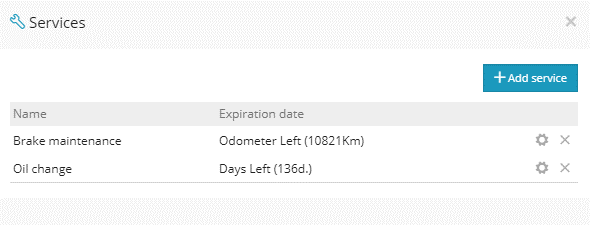

Une fois sélectionné, vous serez invité à saisir les informations suivantes:

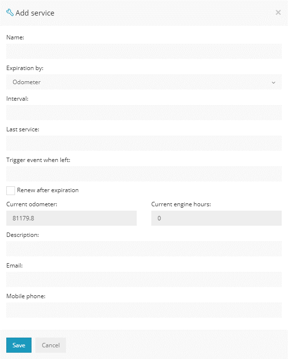

***Nom :*** dans ce champ, vous pouvez ajouter un nom pour le service planifié.
***Expiration avant*** - Ceci est utilisé pour configurer une expiration lorsque le véhicule atteint un intervalle spécifique pour l'une des options suivantes.

    * Odomètre 
    * Heures moteur
    * Journées

***Intervalle:***  Réglage d'un compteur kilométrique, d'heures moteur ou d'intervalles de jour spécifiques lorsque le véhicule doit être entretenu
***Dernier service:*** Utilisé pour entrer une valeur lors du dernier entretien du véhicule (compteur kilométrique, heure moteur ou date)
***Événement de déclenchement à gauche*** : Une valeur à être entré si une alerte doit être déclenchée quand il reste un montant spécifique avant le service.
***Renouveler après expiration :*** renouvelle automatiquement le calendrier de service.
***Description :*** Une brève description du service.
***Courriel / Numéro de téléphone :*** requis si une alerte doit être envoyée avant la réparation du véhicule.

Pour afficher tous les programmes de maintenance créés, accédez à *Outils -> Maintenance*

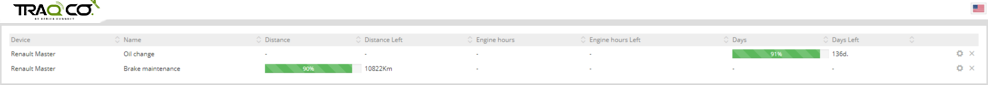

>## Outils: tableau de bord

La fonction de tableau de bord est utilisée pour afficher des informations utiles de manière plus complète. Il peut être utilisé pour afficher l'activité de l'appareil, les événements, le nombre d'appareils (en ligne / hors ligne), le nombre et la progression des tâches et la distance parcourue par les appareils.
Il peut s'ouvrir manuellement ou en configurant que le tableau de bord s'ouvre à chaque fois que vous ouvrez la carte.

Pour activer l'ouverture automatique du tableau de bord et activer les informations à afficher, accédez à *Configuration -> Tableau de bord*.

Pour ouvrir le tableau de bord manuellement, accédez à *Outils -> Tableau de bord*

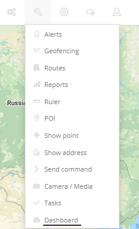

Un aperçu du tableau de bord:

>## Outils: partage

L'outil de partage est utilisé pour créer un lien partageable pour suivre les objets GPS sans avoir à se connecter à la plate-forme Web.
Pour accéder au menu d'outils Partage, accédez à *Outils -> Partage*.

Une fois ouvert, vous serez accueilli avec le menu suivant:

Pour créer un lien partageable, sélectionnez les appareils de la liste que vous souhaitez afficher sur la carte pour que les autres les voient.
Il existe 3 options pour les durées:

***Aucune*** - Le lien durera indéfiniment jusqu'à ce qu'il soit supprimé.

***Durée*** - Le lien sera accessible pendant une durée spécifique, qui peut aller jusqu'à 180 minutes.

***Date*** - Une date spécifique peut être définie jusqu'à l'expiration du lien de partage.

 * ***Supprimer après expiration*** - cette option est disponible lorsqu'une date / heure d'expiration est définie pour que le lien le supprime une fois qu'il a expiré.
    
Sous les appareils, vous avez la possibilité de saisir un ou plusieurs e-mails pour envoyer un lien dès sa création.

Pour afficher, modifier et supprimer les liens de partage créés, accédez à "*Partages*" en haut du menu.

