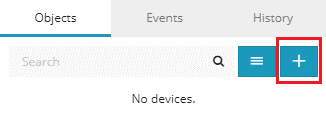
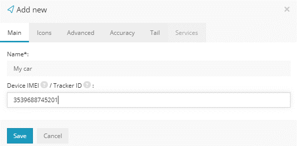
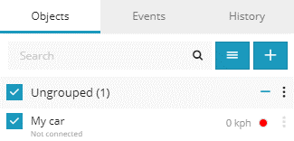

>## Création d'un appareil

  

 Pour commencer à créer et configurer un appareil, dans le panneau de gauche sous l'onglet "*Appareils*", sélectionnez l'icône "*+*".

 

Un nouveau menu apparaîtra vous demandant de remplir le nom de l'objet et IMEI.
L'IMEI de l'appareil se trouve imprimé sur un autocollant sur l'appareil.

Une fois les détails des objets remplis, sélectionnez "*Enregistrer*" et l'appareil créé apparaîtra dans la liste des appareils.

>## Configuration d'un appareil

La plupart des appareils de suivi GPS sont configurables à l'aide d'une série de commandes SMS. Les configurations les plus importantes pour que l'appareil de suivi soit reconnu par le serveur sont l'adresse IP du serveur que vous utilisez, le port de l'appareil, le nom APN et le nom d'utilisateur et le mot de passe (si requis par le support de données) et le fuseau horaire , qui doit être défini sur UTC-0.

Pour vérifier le port utilisé par votre appareil, consultez notre page des trackers pris en charge ici . Une liste des adresses IP de notre serveur peut également être trouvée dans la page des trackers pris en charge. Assurez-vous de vous référer au manuel d'utilisation de votre appareil spécifique pour les commandes de configuration SMS.
Voici un exemple de commandes SMS utilisées pour les appareils *Coban GT02A* :

* ***Fuseau horaire # e0 #*** - Paramètres de fuseau horaire (UTC-0)
* ***Apn # APNname # APNusername # APNpassword #***  - Détails APN. S'il n'y a pas d'informations d'identification pour l'APN, peut être laissé vide.
* ***Ip # 138.201.205.20 # 6002 #*** - Configurations d'adresse IP et de port. 
* ***Upload # 10 #*** - Intervalle de téléchargement des données (secondes)

Une fois l'appareil configuré, il apparaîtra en ligne.
Veuillez prévoir jusqu'à 1 minute pour que le serveur reçoive le premier paquet de données de l'appareil.

