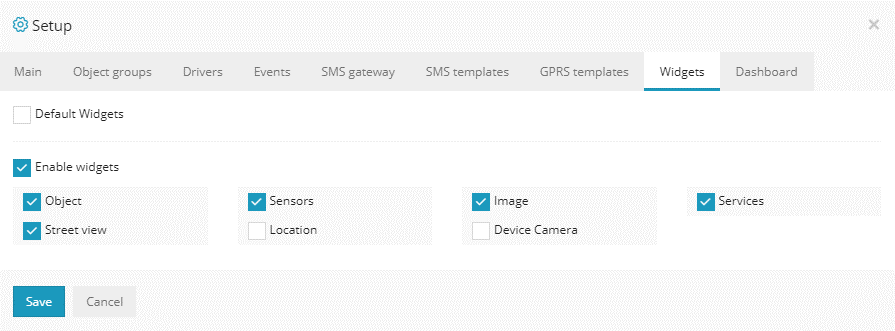
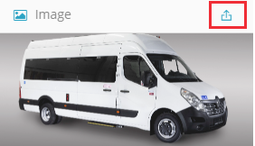
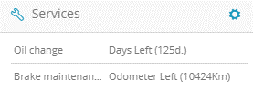

>## Ajout/Suppression

Vous pouvez modifier les widgets que vous souhaitez voir sur votre carte principale à l'aide de la configuration .

En désactivant les «widgets par défaut», vous pouvez ajouter ou supprimer ces derniers.

Les widgets sélectionnés apparaîtront en bas de la carte principale:

>## Objet

Le widget objet affiche les informations sur les appareils, telles que l'adresse, l'heure, la durée de l'arrêt et le conducteur occupant le véhicule.

>## Capteurs

Il montre tous les capteurs ajoutés pour le véhicule - niveau de carburant, état d'allumage, vitesse actuelle. De nombreux autres capteurs peuvent être configurés et affichés.

>## Image de l'appareil

Le widget d'image de l'appareil offre la possibilité d'ajouter l'image du véhicule sur la carte principale. Pour télécharger l'image de l'appareil, sélectionnez le bouton "télécharger" dans le coin supérieur droit du widget et téléchargez l'image que vous souhaitez afficher.

>## Prestations de service

Ce widget affiche tous les services de maintenance créés et la date / intervalle d'échéance pour l'objet. Un guide est disponible expliquant comment créer de tels services sur la page Outils: Maintenance .

>## Vue sur la rue

Le widget Street View affiche l'emplacement actuel des objets à partir de Google Street View.

>## Emplacement

Affiche des informations plus détaillées sur l'emplacement des objets, telles que la ville, le nom de la route, le numéro de la maison si stationné à proximité et le code postal.

>## Appareil photo de l'appareil

Affiche la dernière photo prise par le tracker GPS avec une caméra IP intégrée ou connectée.

>## Carburant

Affiche un graphique du niveau de carburant. Les données affichées sont collectées à partir du capteur de carburant.

