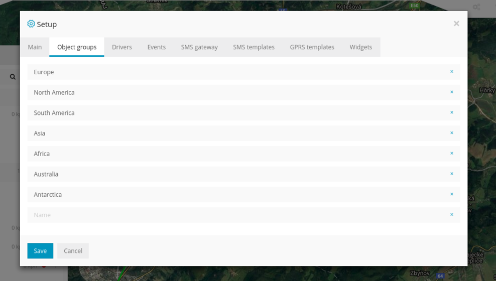
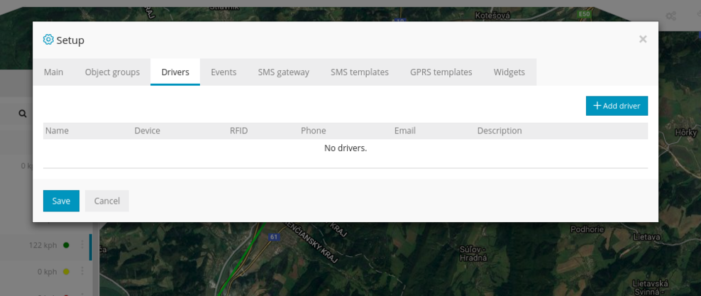
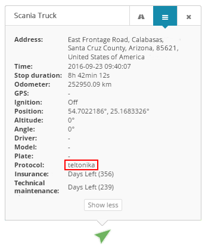
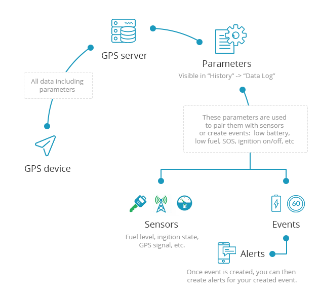
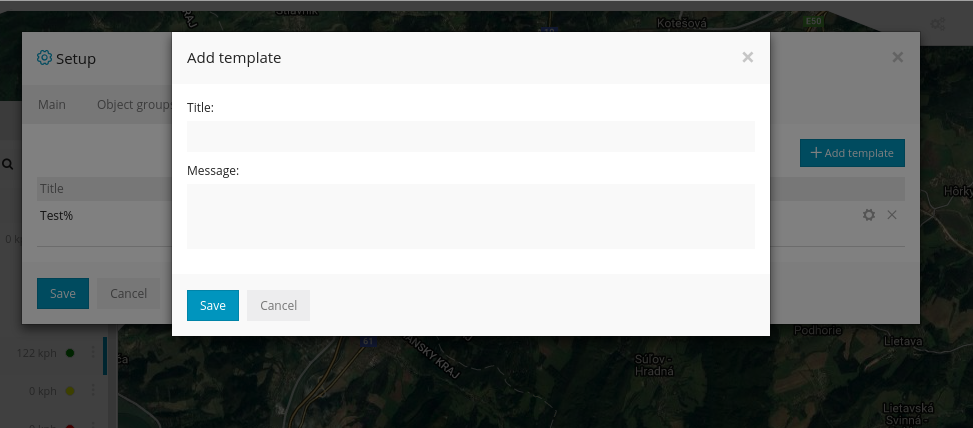
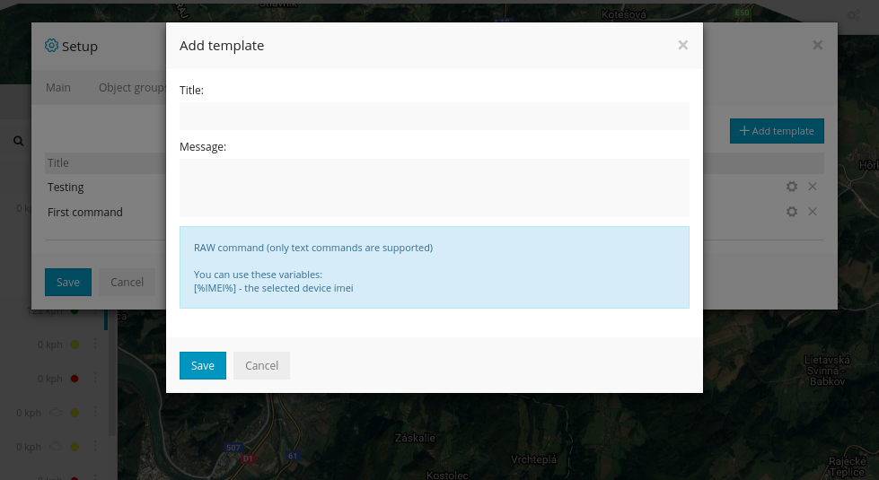

>## Fenêtre de configuration

Dans la fenêtre de configuration, vous pouvez configurer plusieurs paramètres pour tous vos trackers gps, créer des groupes, des pilotes, des événements personnalisés, une passerelle sms, des modèles sms, des modèles gprs.

>## Principale

 

 Dans l'onglet principal, vous pouvez définir la vitesse, la capacité, les mesures d'altitude et également sélectionner le fuseau horaire pour tous vos trackers gps. En bas, il y a la région du serveur et l'adresse IP auxquelles vous êtes connecté. Pour l'heure d'été (DST), il est toujours recommandé d'utiliser l'option Automatique et de sélectionner votre propre pays.

>## Groupes d'objets

 

 Dans l'onglet "Groupes d'objets", vous pouvez créer des groupes pour vos appareils GPS. Pour attribuer un appareil à votre groupe créé, allez dans Objet-> Édition-> Avancé-> Groupe , sélectionnez votre groupe créé et cliquez sur Enregistrer .

>## Conducteurs

Ici, vous pouvez créer des pilotes, cliquez sur "Ajouter un pilote" pour en créer un. Tapez n'importe quel nom et sélectionnez votre appareil GPS. Si votre appareil possède un iButton ou RFID, saisissez le numéro rfid / ibutton dans le champ RFID. Le serveur GPS identifie automatiquement le protocole de l'appareil GPS et décode le message rfid. Après avoir créé un nouveau pilote, glissez la carte / l'élément sur votre appareil rfid et vous devriez voir le nom du pilote dans le panneau inférieur gauche ou en cliquant sur l'objet.

 

>## Événements

Ici, vous pouvez définir vos événements personnalisés. Par exemple, vous pouvez définir que si le bouton SOS est enfoncé, la batterie de l'appareil est faible, etc. l'événement sera déclenché.

Pour savoir quel protocole sélectionner, veuillez connecter votre appareil gps à la plateforme et vérifier les détails de l'objet:

Dans l'image ci-dessus et dans l'exemple ci-dessous, il y a un protocole - "teltonika".

Avant de creuser plus profondément pour créer un événement, veuillez consulter le schéma ci-dessous pour mieux comprendre comment les données transitent du tracker gps vers le serveur gps et comment elles sont traitées:

Pour vérifier quels paramètres votre tracker gps envoie, veuillez aller dans Historique-> Sélectionner un objet-> Afficher l'historique-> Journal de données

*(En haut, il y a les noms des paramètres et en dessous - les valeurs des paramètres)*

Il existe de nombreux noms de paramètres comme "sat, adc1, io21 ..." etc. Donc, si vous voulez créer un événement pour le paramètre "sat", vous devez saisir **sat** dans le champ du nom du paramètre. Ceci **associera** l' événement avec le paramètre.

***Remarque***: *certains trackers gps, comme Coban GPS306 OBD, envoient des noms de paramètres facilement reconnaissables (odomètre, carburant, tr / min, etc.), mais d'autres, comme Teltonika, les envoient comme ioXXX. Pour connaître la signification des noms de paramètres comme ioXXX, vous devez vérifier le manuel d'utilisation / la documentation du fabricant ou les identifier manuellement, par exemple, déclencher certains capteurs et surveiller les paramètres en même temps comme les portes ouvertes, le niveau de carburant, etc.*

**Exemple 1**

Dans l'image ci-dessus, nous avons montré l'événement pour le périphérique GPS teltonika FM1010. Nous savons que le paramètre io66 signifie «alimentation externe» et nous savons également que si la valeur du paramètre tombe en dessous de 1000, cela signifie que le moteur a été arrêté. Nous pouvons vérifier les messages ultérieurs et nous verrons que dans le journal de données, cette valeur de paramètre diminuera après l'arrêt du moteur. Donc, dans l'onglet événement, nous devons sélectionner le protocole teltonika, saisir io66 dans le champ du nom du paramètre, sélectionner moins que dans la case de sélection suivante et entrer 1000 dans le dernier champ. Dans le champ de message, écrivez le texte que vous souhaitez voir quand l'événement est déclenché.

**Exemple 2**

Supposons que le nom de votre paramètre soit batterie et que vous souhaitiez créer un événement "Batterie faible". Dans la fenêtre Ajouter un événement , sélectionnez le protocole de l'appareil, entrez le nom du paramètre de la batterie , sélectionnez moins de et entrez la valeur souhaitée, par exemple 10 ou 15 . Dans le champ du message, écrivez le texte de votre choix. Maintenant, lorsque la batterie de l'appareil tombe à 10 ou 15 , l'événement sera déclenché.

**Exemple 3**

Créons maintenant un événement SOS. Par exemple, le coban gps tracker, lorsque le bouton sos est enfoncé, envoie une alarme de paramètre : aidez-moi , alors tout ce que nous avons à faire est de simplement entrer l' alarme dans le champ du nom du paramètre, sélectionnez égal à et écrivez- moi dans le champ de la valeur du paramètre .

***Remarque***: *les  événements seront déclenchés si une alerte est créée: Outils-> Alertes-> Ajouter nouveau*

**Exaplanation de Setflag:**

Par exemple, le tracker envoie un statut comme celui-ci:

00010 (en mouvement, alarme sos), 10010 (sans mouvement, alarme sos).

Le 4ème chiffre signifie si le sos est envoyé. Un autre nombre peut signifier d'autres statuts, donc au lieu de créer un événement pour chaque combinaison de statuts possible, vous pouvez simplement utiliser setflag, pour détecter uniquement le 4ème nombre de la chaîne.

>## Passerelle SMS

Ici, vous pouvez configurer la passerelle SMS. Vous devez avoir votre propre fournisseur de passerelle SMS comme Bulksms, Plivo, Clickatell ou tout autre. Après avoir activé la passerelle SMS, vos appareils peuvent recevoir des alertes / notifications sur les événements via SMS. Vous pouvez également envoyer des messages SMS à vos appareils via Outils-> Envoyer la commande

Si vous le souhaitez, vous pouvez utiliser votre smartphone Android comme passerelle sms en utilisant cette application:  https://play.google.com/store/apps/details?id=com.gpswox.smsgateway

Après avoir installé cette application, assurez-vous qu'elle dispose des autorisations pour envoyer des SMS.

Si vous utilisez l'URL (transmission de données via la chaîne d'URL), assurez-vous de sélectionner GET comme méthode de demande

>## Modèles SMS

Les modèles créés peuvent être utilisés dans la commande Outils-> Envoyer. Vous n'avez donc pas besoin de taper à nouveau le même message sms.

>## Modèles GPRS

Les modèles créés peuvent être utilisés dans Outils-> Commande d'envoi, vous n'avez donc pas besoin de taper à nouveau la commande. De plus, la variable [% IMEI%] vous aidera à réutiliser le même modèle pour plusieurs trackers gps.

